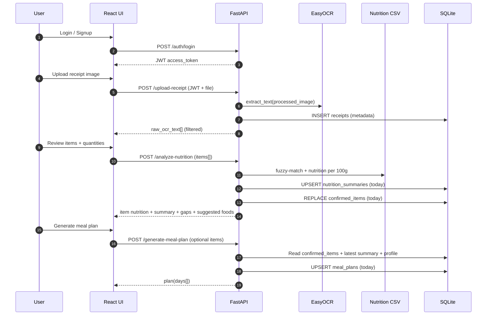

Live-
https://mealsnapai2.netlify.app/

# MealSnap — AI Smart Nutrition Assistant

MealSnap is a full-stack app that uses receipt OCR, a nutrition database, and meal planning to help users track and improve their diet. Upload receipt photos, review and adjust items, get nutrition analysis, and generate weekly meal plans.

## Features

- **Receipt OCR** — Upload receipt images (JPG/PNG); extract and filter food items
- **Nutrition analysis** — Match items to a food database, compute macros, and flag gaps
- **Meal planning** — Generate 7-day meal plans from confirmed items
- **Dashboard** — Weight and nutrition history, purchase suggestions
- **Auth** — Signup/login with JWT; user-scoped data

## Prerequisites

- **Python 3.10+** (backend: FastAPI, EasyOCR, OpenCV, SQLAlchemy)
- **Node.js 18+** and npm (frontend: React)

## Quick start (after clone)

### 1. Backend

```bash
cd backend
python -m venv .venv
.venv\Scripts\activate          # Windows
# source .venv/bin/activate     # macOS/Linux

pip install -r requirements.txt
```

**Optional:** Copy `backend/.env.example` to `backend/.env` and set `JWT_SECRET_KEY` for production. For local dev, defaults are used.

From the `backend` directory:

```bash
uvicorn main:app --reload --host 0.0.0.0 --port 8000
```

Or: `python main.py`

- DB file `mealsnap.db` and `uploads/` are created automatically on first run.
- EasyOCR may download models on first receipt upload.

### 2. Frontend

```bash
cd frontend
npm install
```

**Optional:** Copy `frontend/.env.example` to `frontend/.env` and set `REACT_APP_API_URL` if the API is not at `http://localhost:8000`.

```bash
npm start
```

Frontend runs at [http://localhost:3000](http://localhost:3000).

## Project layout

```
├── backend/           # FastAPI, OCR, nutrition logic
│   ├── db/            # SQLAlchemy models, DB init
│   ├── meal_plan/     # Meal planning rules and planner
│   ├── ocr/           # EasyOCR-based text extraction
│   ├── utils/         # Food matching, nutrition, image preprocessing
│   ├── main.py        # API entrypoint
│   └── requirements.txt
├── data/
│   └── nutrition_database.csv   # Food names, aliases, macros (required)
├── frontend/          # React app
│   └── src/
└── README.md
```

## Environment variables

| Variable | Where | Purpose |
|----------|-------|---------|
| `JWT_SECRET_KEY` | backend | Signing key for JWTs. **Set in production.** |
| `DATABASE_URL` | backend | DB URL. Default: `sqlite:///./mealsnap.db` |
| `REACT_APP_API_URL` | frontend | API base URL. Default: `http://localhost:8000` |

Use `backend/.env.example` and `frontend/.env.example` as templates. Do not commit `.env` files.

## Not in the repo (see .gitignore)

- `.env` and other secret files
- `backend/mealsnap.db`, `backend/uploads/`, `backend/processed/`
- `frontend/node_modules/`, `frontend/build/`
- Python `__pycache__/`, `venv/`, `.venv/`

**If any of these were already committed,** remove from tracking with  
`git rm -r --cached backend/mealsnap.db backend/uploads backend/processed` and  
`git rm --cached .env backend/.env frontend/.env` (as applicable), then commit.

## API

- **Base URL:** `http://localhost:8000`
- **Docs:** [http://localhost:8000/docs](http://localhost:8000/docs)
- **Health:** `GET /health`

## License

MIT (or your preferred license).

---

## 6. UML / System Analysis / Architecture Diagrams

### 6.1 High-level architecture (Block / System diagram)

```mermaid
flowchart LR
  U[User (Browser)] -->|HTTP/JSON| FE[Frontend (React)]
  FE -->|JWT in Authorization header| API[Backend API (FastAPI)]
  API -->|SQLAlchemy| DB[(SQLite DB)]
  API -->|Read CSV| CSV[(nutrition_database.csv)]
  API -->|Preprocess image| IMG[OpenCV / image_processing]
  API -->|OCR| OCR[EasyOCR]
  API -->|Store files| FS[(uploads/ + processed/)]

  subgraph Backend modules
    API --> AUTH[/auth/* (JWT)/]
    API --> RCP[/upload-receipt + /receipts/history/]
    API --> NUT[/analyze-nutrition + /nutrition-gaps/]
    API --> REC[/next-purchase-suggestions/]
    API --> MP[/generate-meal-plan/]
    API --> DASH[/dashboard/]
    API --> WT[/weight/*/]
    API --> PROF[/profile + /nutrition/target/]
  end
```

### 6.2 Core workflow (Sequence diagram)



---

## 7. Data Dictionary / Data Sets

### 7.1 Primary dataset (CSV)

- **File**: `data/nutrition_database.csv`
- **Purpose**: Canonical food names + aliases + macro values used for fuzzy matching and nutrition calculations.
- **Expected fields (as used in code)**:
  - `food_name` (string): canonical display name
  - `aliases` (string): optional, multiple names separated by comma/semicolon/pipe
  - `calories_per_100g` (number)
  - `protein_per_100g` (number)
  - `carbs_per_100g` (number)
  - `fats_per_100g` (number)
  - `category` (string, optional)

### 7.2 Database (SQLite) tables (SQLAlchemy models)

All tables are **user-scoped** via `user_id` and are not shared between users.

#### `users`

| Field | Type | Constraints | Description |
|------|------|-------------|-------------|
| `id` | int | PK | User identifier |
| `username` | string(64) | unique, not null | Login username |
| `email` | string(256) | unique, not null | Login email |
| `hashed_password` | string(256) | not null | Password hash (never plain text) |
| `created_at` | datetime | not null | Account creation time (UTC) |

#### `user_profile`

| Field | Type | Constraints | Description |
|------|------|-------------|-------------|
| `user_id` | int | unique, FK(users.id) | Owner user |
| `age` | int | nullable | Age |
| `gender` | string(32) | nullable | “male/female” (or variants) |
| `height_cm` | float | nullable | Height in cm |
| `current_weight_kg` | float | nullable | Current weight (kg) |
| `target_weight_kg` | float | nullable | Goal weight (kg) |
| `activity_level` | string(16) | nullable | low/moderate/high |
| `diet_preference` | string(16) | nullable | veg/non-veg/vegan |
| `fitness_goal` | string(24) | nullable | lose/maintain/gain weight |

#### `receipts`

| Field | Type | Constraints | Description |
|------|------|-------------|-------------|
| `id` | int | PK | Receipt row id |
| `user_id` | int | FK(users.id) | Owner user |
| `upload_time` | datetime | not null | Upload time (UTC) |
| `file_path` | text | not null | Saved file path under `uploads/{user_id}/` |

#### `confirmed_items`

| Field | Type | Constraints | Description |
|------|------|-------------|-------------|
| `id` | int | PK | Row id |
| `user_id` | int | FK(users.id) | Owner user |
| `date` | date | index | Logical “receipt day” |
| `name` | string | not null | Confirmed item name |
| `quantity` | float | nullable | Quantity value |
| `unit` | string | nullable | Unit (g/kg/ml/L/pcs, etc.) |

#### `nutrition_summaries`

| Field | Type | Constraints | Description |
|------|------|-------------|-------------|
| `id` | int | PK | Row id |
| `user_id` | int | FK(users.id) | Owner user |
| `date` | date | unique per user/day | Summary date |
| `calories` | float | default 0 | Total kcal/day |
| `protein` | float | default 0 | Total protein (g) |
| `carbs` | float | default 0 | Total carbs (g) |
| `fats` | float | default 0 | Total fats (g) |

#### `weight_entries` (legacy daily)

| Field | Type | Constraints | Description |
|------|------|-------------|-------------|
| `user_id` | int | unique per user/day | Owner user |
| `date` | date | unique per user/day | Day |
| `weight` | float | not null | Weight value (unit depends on usage) |

#### `weight_logs` (timestamped)

| Field | Type | Constraints | Description |
|------|------|-------------|-------------|
| `user_id` | int | unique per user/day | Owner user |
| `weight_kg` | float | not null | Weight in kg |
| `recorded_date` | date | unique per user/day | Day key |
| `recorded_at` | datetime | not null | Timestamp (UTC) |
| `body_fat_percentage` | float | nullable | Optional BF% |
| `note` | text | nullable | Optional note |

#### `meal_plans`

| Field | Type | Constraints | Description |
|------|------|-------------|-------------|
| `user_id` | int | unique per user/day | Owner user |
| `date` | date | unique per user/day | Plan date |
| `plan_data` | text | not null | JSON string with `days[]` plan |
| `created_at` | date | not null | Stored date field (current design) |

---

## 8. Screen Layouts (UI)

Frontend routes (see `frontend/src/App.jsx`) and typical layout content:

- **`/signup`**: username, email, password fields; create account.
- **`/login`**: username/email + password; receives JWT; stores auth state.
- **`/dashboard`** (protected):
  - weight trend + BMI/goal progress (if profile + logs exist)
  - nutrition history chart/table
  - latest meal plan preview (if generated)
  - gap + grocery recommendations sections (derived from latest summary)
- **`/upload`** (protected): receipt image uploader (JPG/PNG), progress + error states.
- **`/upload/next`** (protected): “next step” after OCR, navigation into item review.
- **`/nutrition-summary`** (protected): per-item nutrition results + totals + gap labels.
- **`/meal-plan`** (protected): generated multi-day plan view.
- **`/profile`** (protected): personal profile form (age/height/weights/activity/diet/goal).
- **`/recommendations`** (protected): purchase recommendations based on stored gaps/summary.
- **`/receipt-history`** (protected): list of past receipt upload dates + calories + item counts.

---

## 9. Report Layouts (if applicable)

This project is primarily an interactive web app; “reports” are presented as screens. Common “report-style” views include:

- **Nutrition Summary report** (`/nutrition-summary`): totals (kcal/protein/carbs/fats), matched vs unmatched items, unknown items list, gaps, suggested foods.
- **Dashboard report** (`/dashboard`): time-windowed weight and nutrition history + computed insights.
- **Receipt History report** (`/receipt-history`): per-upload summaries linked by `receipt_date`.

If you need a printable PDF report later, it can be generated from these payloads (Future Enhancements).

---

## 10. Sample Coding (key implementations)

### 10.1 Receipt upload + user-scoped storage

```632:702:backend/main.py
@app.post("/upload-receipt")
async def upload_receipt(
    current_user: CurrentUser,
    file: UploadFile = File(...),
    db: Session = Depends(get_db),
):
    """
    Upload receipt image, preprocess it, run OCR, and return extracted text.
    Filters out prices, totals, and numbers.

    User-based data isolation: receipts are stored under uploads/{user_id}/ and
    processed/{user_id}/. Files are never shared between users.
    """
    # ... saves file, runs preprocess + OCR, filters lines, returns payload ...
```

### 10.2 Fuzzy matching with alias mapping (nutrition database)

```23:227:backend/utils/food_matcher.py
def load_nutrition_database_with_mapping() -> Tuple[List[str], Dict[str, str]]:
    # ... loads food_name + aliases into a normalized list and alias->canonical map ...
    return food_names, alias_to_canonical

def match_food_name(
    normalized_food_name: str,
    similarity_threshold: float = 80.0,
    database_foods: Optional[list[str]] = None,
    alias_mapping: Optional[Dict[str, str]] = None
) -> Optional[Tuple[str, float, bool]]:
    # ... exact-match fast path, then RapidFuzz WRatio/token_set_ratio ...
    # ... boosts confidence for alias matches ...
    return (canonical_name, boosted_score, is_alias_match)
```

### 10.3 User-scoped persistence model (DB schema)

```19:128:backend/db/models.py
class NutritionSummaryEntry(Base):
    __tablename__ = "nutrition_summaries"
    id: Mapped[int] = mapped_column(Integer, primary_key=True, autoincrement=True)
    user_id: Mapped[int] = mapped_column(Integer, ForeignKey("users.id"), nullable=False, index=True)
    date: Mapped[date] = mapped_column(Date, nullable=False, index=True)
    calories: Mapped[float] = mapped_column(Float, nullable=False, default=0.0)
    protein: Mapped[float] = mapped_column(Float, nullable=False, default=0.0)
    carbs: Mapped[float] = mapped_column(Float, nullable=False, default=0.0)
    fats: Mapped[float] = mapped_column(Float, nullable=False, default=0.0)
```

---

## 11. Future Enhancements (optional)

- **Better nutrition model**: micronutrients (fiber, sugar, sodium), dietary reference intakes, and per-user targets beyond simple heuristics.
- **Improved OCR pipeline**: receipt line-item detection (quantity/price parsing), store templates, multilingual OCR, and confidence-based UI review.
- **Barcode integration**: scan/lookup items when OCR is uncertain.
- **Personalized meal planning**: enforce dietary preferences, allergies, cuisines, budget constraints; auto-shopping list.
- **Printable reports**: export dashboard/nutrition/meal plan as PDF.
- **Cloud deployment**: Postgres, object storage (S3), background OCR jobs, and proper secret management.
- **Security hardening**: refresh tokens, stricter CORS, rate limiting, and better audit logging.

---

## 12. Conclusion

MealSnap demonstrates a complete end-to-end system that turns receipt images into structured food items, calculates daily macro intake via a nutrition dataset, highlights nutrition gaps, and produces meal plans and recommendations — all while keeping stored data isolated per authenticated user.

---

## 13. Bibliography

- **FastAPI documentation**: `https://fastapi.tiangolo.com/`
- **SQLAlchemy documentation**: `https://docs.sqlalchemy.org/`
- **EasyOCR (OCR engine)**: `https://github.com/JaidedAI/EasyOCR`
- **OpenCV documentation**: `https://docs.opencv.org/`
- **RapidFuzz (fuzzy matching)**: `https://github.com/rapidfuzz/RapidFuzz`
- **React documentation**: `https://react.dev/`


REACT_APP_DEMO_EMAIL=alex.tester@example.com
REACT_APP_DEMO_PASSWORD=TestPassword!123
